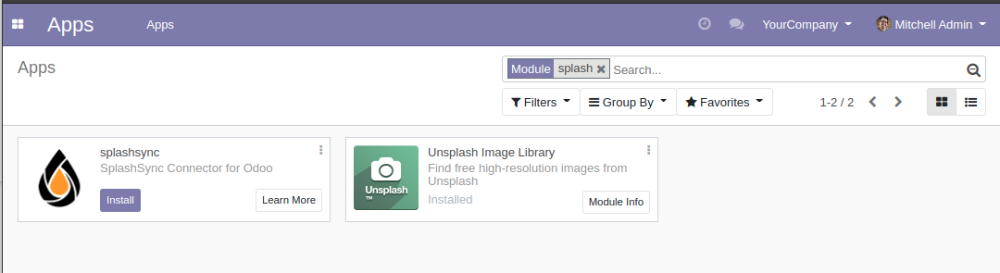
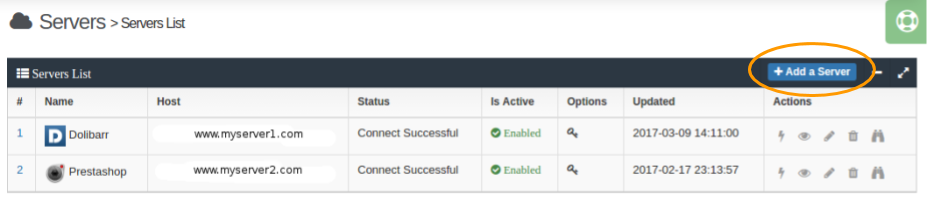
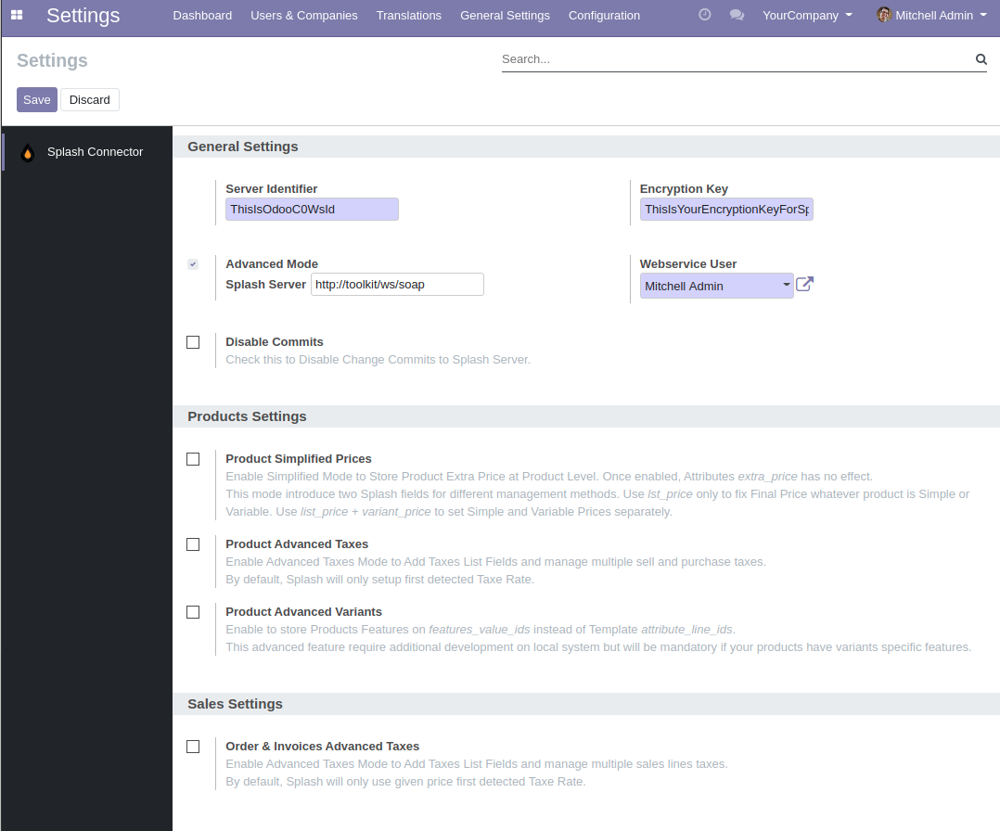

### Activation du module

Dans le menu principal, choisissez **Apps**, cherchez "splashsync" et installez le module.

### Configuration du module Splash

D'abord, vous devez créer des clés d'accès pour votre module sur notre site.
Pour ce faire, sur votre compte Splash, allez dans **Serveurs** > **Ajouter un serveur** et notez les clés d'identification et de cryptage qui vous sont données.

Ensuite, allez dans **Apps** > **Configuration** et saisissez les clés dans la configuration du module (attention à ne pas oublier de caractère).

